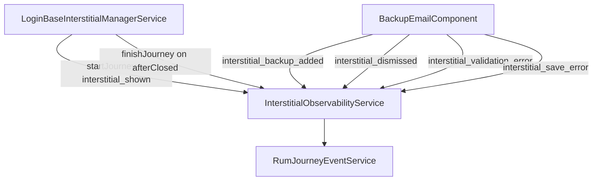

# Interstitial observability

## Purpose

Measure how well the sign-in interstitials perform: how often each is shown, and what the user does with it — added, dismissed, blocked by a validation error, or lost to a save failure.

Before this, nothing in `cdk/interstitials/**` or `core/login-interstitials-manager/**` emitted any analytics at all.

## Scope / Emitters

Paths relative to `src/app/`:

- `core/login-interstitials-manager/interstitial-observability.service.ts` — the facade every emitter goes through
- `core/login-interstitials-manager/abstractions/login-abstract-interstitial-manager.service.ts` — emits `interstitial_shown` and finishes the journey. Shared, so **all** interstitials report a comparable denominator
- `cdk/interstitials/backup-email/interstitial-component/backup-email.component.ts` — outcome events for the backup email interstitial

`share-emails-domains` and `affiliations-interstitial` currently report `interstitial_shown` (via the shared manager) but no outcomes.

## Event model

- Journey type **`interstitial`**, one journey per interstitial shown.
- New Relic model:
  - `eventType() = 'PageAction'`
  - `actionName = 'interstitial'`
  - `system_eventName = <event name>`
  - `system_journeyId` correlates the shown event with its outcome
  - `system_elapsedMs` gives time to decision
  - `journeyContext_interstitialName` = the `InterstitialType`, e.g. `BACKUP_EMAIL_INTERSTITIAL`

Context and attribute shapes live in [`journeys/interstitial.ts`](./journeys/interstitial.ts).

## New Relic harvest on terminal outcomes

`interstitial_backup_added`, `interstitial_dismissed`, and `interstitial_save_error` are registered as terminating in [`terminating-rum-events.ts`](./terminating-rum-events.ts), so `forceHarvestNow()` runs after `addPageAction`. `interstitial_validation_error` is deliberately **not** terminal — the user stays in the dialog.

## Flow diagram



## Key events and where they fire

| Event                           | Fires when                                                                                     | Terminal |
| ------------------------------- | ---------------------------------------------------------------------------------------------- | -------- |
| `interstitial_shown`            | The dialog is opened, from the shared manager                                                  | no       |
| `interstitial_backup_added`     | `postEmails` succeeded                                                                         | yes      |
| `interstitial_dismissed`        | "Continue without adding a backup email address"                                               | yes      |
| `interstitial_validation_error` | Submit blocked by an inline error; `validationErrorKind` is `required`, `invalid`, or `in_use` | no       |
| `interstitial_save_error`       | The save request failed and the dialog closed                                                  | yes      |

Dismissal and save-failure are emitted at separate call sites on purpose — both funnel into the same `finishIntertsitial()` exit and would otherwise be indistinguishable.

## NRQL query patterns

Funnel by interstitial:

```sql
FROM PageAction SELECT count(*)
WHERE actionName = 'interstitial'
FACET journeyContext_interstitialName, system_eventName
SINCE 1 week ago
```

Add rate for the backup email interstitial:

```sql
FROM PageAction SELECT
  filter(uniqueCount(system_journeyId), WHERE system_eventName = 'interstitial_backup_added')
  / filter(uniqueCount(system_journeyId), WHERE system_eventName = 'interstitial_shown') * 100
  AS 'add rate %'
WHERE actionName = 'interstitial'
AND journeyContext_interstitialName = 'BACKUP_EMAIL_INTERSTITIAL'
SINCE 1 week ago
```

Dismiss rate — swap `interstitial_backup_added` for `interstitial_dismissed`.

Which validation errors block people most:

```sql
FROM PageAction SELECT count(*)
WHERE actionName = 'interstitial'
AND system_eventName = 'interstitial_validation_error'
FACET eventAttribute_validationErrorKind
SINCE 1 week ago
```

Time to decision:

```sql
FROM PageAction SELECT percentile(system_elapsedMs, 50, 90)
WHERE actionName = 'interstitial'
AND system_eventName IN ('interstitial_backup_added', 'interstitial_dismissed')
FACET system_eventName SINCE 1 week ago
```

## Checking it without New Relic

Every event is also written to the browser console via `console.debug`, gated on `runtimeEnvironment.debugger` — on for local/QA/int, off for production and sandbox. The line is printed whether or not delivery to New Relic succeeded, so it confirms the app raised the event, not that it arrived.

Open DevTools, **set the log level to `Verbose`** (`console.debug` is hidden otherwise), and filter on `journey:interstitial`:

```
[RUM][journey:interstitial] : start
[RUM][journey:interstitial] : event interstitial_shown
[RUM][journey:interstitial] : event interstitial_dismissed
[RUM][journey:interstitial] : finished
```

`system_journeyId` should be identical across one journey — that is what correlates the outcome with the shown event. QA steps are in `orcid-constiution/docs/playbooks/qa-backup-email-interstitial.md`.

## Gotchas

- **Attribute keys are redacted if they contain `orcid`, `email`, `pid`, or `delegator`** (`BLOCKED_RUM_KEY_PATTERN` in [`service/customEvent.service.ts`](./service/customEvent.service.ts)). An attribute named `backupEmail` or `emailValid` arrives as a `[PID_HINT:…]` string and is useless for faceting. Use `interstitialName`, `validationErrorKind`, `formValid`. String _values_ matching an address are redacted too — never send one.
- `recordEvent` before `startJourney` is **silently dropped**, and a second `startJourney` for the same type is a no-op. Since only one interstitial shows per session (`take(1)` in the main manager), overlapping journeys should not occur.
- Everything here is gated on the `RUM` togglz. With it off, no events are emitted at all.
- `interstitial_shown` counts dialogs _opened_, not users _eligible_. Users who were eligible but blocked earlier in the chain (togglz off, already seen, session already checked) never reach it. For an eligibility denominator use `profile_interstitial_flag` in the warehouse.
