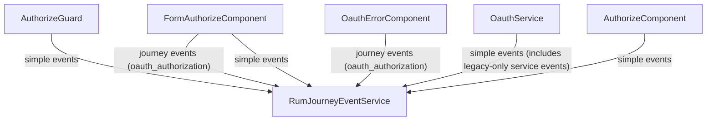

# OAuth observability

## Purpose

Describe how OAuth authorization and OAuth error flows emit observability signals, and how those signals should be queried in New Relic.

## Scope / Emitters

Primary emitters (paths relative to `src/app/`):

- `authorize/components/form-authorize/form-authorize.component.ts`
- `authorize/components/oauth-error/oauth-error.component.ts`
- `guards/authorize.guard.ts`
- `authorize/pages/authorize/authorize.component.ts`
- `core/oauth/oauth.service.ts`
- `rum/oauth-authorize-http-failure-event-attrs.ts`

## Event model

- OAuth uses both:
  - journey events with `journeyType = oauth_authorization`
  - simple events for guard/page/service outcomes.
- Journey signals:
  - `actionName = 'oauth_authorization'`
  - logical event name in `system_eventName`
  - context in `journeyContext_*`
  - event attrs in `eventAttribute_*`.
- Simple signals:
  - `actionName = <eventName>` on `PageAction`.

## New Relic harvest on terminal outcomes

OAuth guard outcomes, the oauth-error page, and journey terminals such as `authorization_success`, `authorization_denied`, `authorization_error`, `authorization_logout`, and `error_page_loaded` are wired as **terminating** events: after a successful `addPageAction`, `RumJourneyEventService` triggers an immediate harvest so data is less likely to be lost on redirect or tab close. The exact name lists and rules are in [`terminating-rum-events.ts`](./terminating-rum-events.ts). Overview: [RUM README — Terminating events and New Relic harvest](./README.md#terminating-events-and-new-relic-harvest-flush).

## Flow diagram

## Key events and where they fire

Journey events (`actionName = oauth_authorization`):

- `authorization_page_loaded`
- `error_page_loaded`
- `authorization_success`
- `authorization_denied`
- `authorization_error`
- `authorization_logout` (logout interruption marker inside the OAuth journey)

Key journey context fields:

- `journeyContext_OAUTH_AUTHORIZATION` (feature-flag state)
- `journeyContext_justRegistered` (true only when OAuth starts immediately after successful registration)

`OAUTH_AUTHORIZATION` is carried in journey context (not emitted as a standalone journey event).
`justRegistered` is a one-time internal handoff flag (stored client-side), not a URL query parameter on OAuth authorize URLs.

Simple OAuth-related events include:

- Guard decisions (`oauth_authorize_guard_*`)
- `oauth_authorize_page_already_authorized_redirect`
- `oauth_authorize_auth_server_error_body`
- `oauth_authorize_switch_delegated_account`
- Legacy-only service events:
  - `oauth_session_client_handled_error_redirect_legacy`
  - `oauth_session_navigate_authorize_error_legacy`

## NRQL query patterns

Journey view:

- `FROM PageAction SELECT count(*) WHERE actionName = 'oauth_authorization' FACET system_eventName`
- `FROM PageAction SELECT count(*) WHERE actionName = 'oauth_authorization' FACET journeyContext_justRegistered`
- `FROM PageAction SELECT count(*) WHERE actionName = 'oauth_authorization' AND system_eventName = 'error_page_loaded' FACET eventAttribute_error_category`

Simple OAuth events:

- `FROM PageAction SELECT count(*) WHERE actionName LIKE 'oauth_%'`

Legacy-only OAuth events:

- `FROM PageAction SELECT count(*) WHERE actionName IN ('oauth_session_client_handled_error_redirect_legacy','oauth_session_navigate_authorize_error_legacy')`

## Troubleshooting / gotchas

- `recordEvent(...)` is dropped when the journey was not started.
- Mid-session logout paths record `authorization_logout` with `eventAttribute_oauth_logout_reason` (`session_logged_out` or `user_initiated_logout`) inside the same journey.
- Success/deny redirects use a short client-side delay (~400ms) before `outOfRouterNavigation(...)` to improve event delivery reliability for `authorization_success` / `authorization_denied`.
- `access_denied` from auth server is treated as an expected deny outcome path, not a service error.
- OAuth telemetry is intentionally layered with global `http_error` / `client_error` from `ErrorHandlerService`; dual signals are expected.
- The auth-server vs legacy endpoint split is tracked in OAuth error attrs (`oauth_authorize_endpoint`) where applicable.
- OAuth emitters avoid personal fields by design, and telemetry payloads are sanitized before send; ORCID iDs, emails, and PID-like identifiers are obfuscated into hint strings before forwarding to New Relic.
