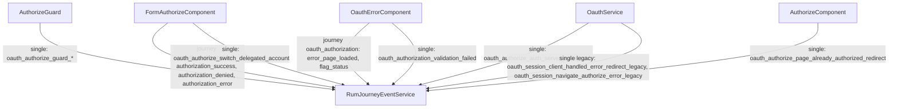

# OAuth observability

## Purpose

Describe how OAuth authorization and OAuth error flows emit observability signals, and how those signals should be queried in New Relic.

## Scope / Emitters

Primary emitters:

- `authorize/components/form-authorize/form-authorize.component.ts`
- `authorize/components/oauth-error/oauth-error.component.ts`
- `guards/authorize.guard.ts`
- `authorize/pages/authorize/authorize.component.ts`
- `core/oauth/oauth.service.ts`
- `rum/oauth-authorize-http-failure-event-attrs.ts`

## Event model

- OAuth uses both:
  - journey events with `journeyType = oauth_authorization`
  - simple events for guard/page/service outcomes.
- Journey signals:
  - `actionName = 'oauth_authorization'`
  - logical event name in `system_eventName`
  - context in `journeyContext_*`
  - event attrs in `eventAttribute_*`.
- Simple signals:
  - `actionName = <eventName>` on `PageAction`.

## Flow diagram

## Key events and where they fire

Journey events (`actionName = oauth_authorization`):

- `error_page_loaded`
- `flag_status`
- `authorization_success`
- `authorization_denied`
- `authorization_error`

Simple OAuth-related events include:

- Guard decisions (`oauth_authorize_guard_*`)
- `oauth_authorize_page_already_authorized_redirect`
- `oauth_authorization_validation_failed`
- `oauth_authorize_auth_server_error_body`
- `oauth_authorize_switch_delegated_account`
- Legacy-only service events:
  - `oauth_session_client_handled_error_redirect_legacy`
  - `oauth_session_navigate_authorize_error_legacy`

## NRQL query patterns

Journey view:

- `FROM PageAction SELECT count(*) WHERE actionName = 'oauth_authorization' FACET system_eventName`

Simple OAuth events:

- `FROM PageAction SELECT count(*) WHERE actionName LIKE 'oauth_%'`

Legacy-only OAuth events:

- `FROM PageAction SELECT count(*) WHERE actionName IN ('oauth_session_client_handled_error_redirect_legacy','oauth_session_navigate_authorize_error_legacy')`

## Troubleshooting / gotchas

- `recordEvent(...)` is dropped when the journey was not started.
- `access_denied` from auth server is treated as an expected deny outcome path, not a service error.
- OAuth telemetry is intentionally layered with global `http_error` / `client_error` from `ErrorHandlerService`; dual signals are expected.
- The auth-server vs legacy endpoint split is tracked in OAuth error attrs (`oauth_authorize_endpoint`) where applicable.

