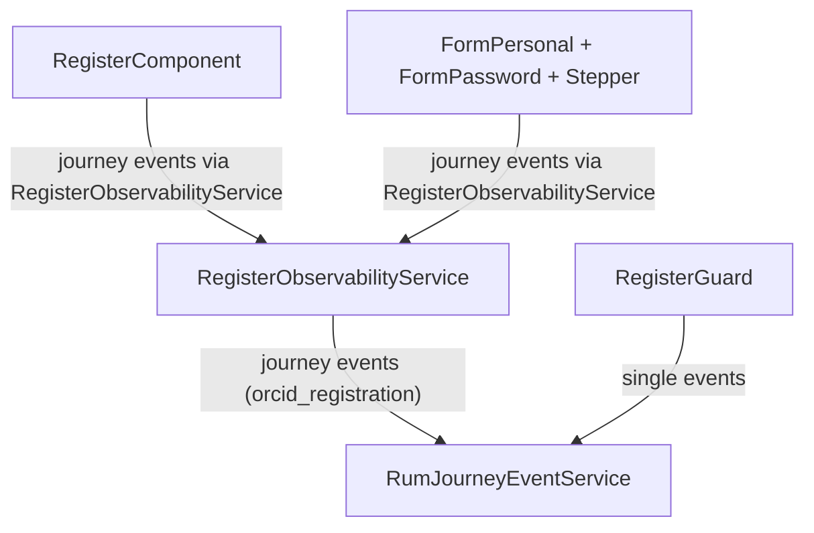

# Registration observability

## Purpose

Describe registration instrumentation end-to-end: journey lifecycle, step/funnel signals, and completion outcomes.

## Scope / Emitters

Primary emitters:

- `register/register-observability.service.ts`
- `register/pages/register/register.component.ts`
- `register/components/form-personal/form-personal.component.ts`
- `register/components/form-password/form-password.component.ts`
- `register/app-event-names.ts`

Related pre-flow guard signal:

- `guards/register.guard.ts` (`register_guard_redirect_to_authorize`)

## Event model

- Registration uses journey events with `journeyType = orcid_registration`.
- New Relic model:
  - `actionName = 'orcid_registration'`
  - logical event in `system_eventName`
  - journey context in `journeyContext_*`
  - per-event attrs in `eventAttribute_*`.

## Flow diagram

## Key events and where they fire

Journey events (`actionName = 'orcid_registration'`):

- From `RegisterObservabilityService.initializeJourney(...)`:
  - starts journey with context keys like `isReactivation`, `coulumn4`, `column8`, `column12`.
- From `RegisterObservabilityService.stepLoaded(...)`:
  - `step-a-loaded`, `step-b-loaded`, `step-c2-loaded`, `step-c-loaded`, `step-d-loaded`.
- From `RegisterObservabilityService` step actions:
  - `step-a-sign-in-button-clicked`
  - `step-a-next-button-clicked`
  - `step-b-next-button-clicked`
  - `step-c2-next-button-clicked`
  - `step-c2-skip-button-clicked`
  - `step-c-next-button-clicked`
  - `step-d-next-button-clicked`
  - dynamic back-button events: `step-<x>-back-button-clicked`.
- From `RegisterComponent.register(...)` via `reportRegisterEvent/reportRegisterErrorEvent`:
  - `prefill_register-form`
  - `register-validate`
  - `register-validate-error`
  - `register-confirmation`
  - `register-confirmation-error`
  - `register_pipeline_error` (submit pipeline failure branch).
- Completion events:
  - `journey-complete` emitted by `RegisterObservabilityService.completeJourney(...)`.
  - `journey_finished` emitted by `finishJourney(...)` immediately after completion.
  - `eventAttribute_redirectUrl` contains the backend-provided redirect URL (not rewritten to append `justRegistered`).

Simple events (outside `orcid_registration` journey):

- From `RegisterGuard`:
  - `register_guard_redirect_to_authorize` when an OAuth-aware signed-in session is redirected away from register.

## NRQL query patterns

Journey funnel:

- `FROM PageAction SELECT count(*) WHERE actionName = 'orcid_registration' FACET system_eventName`

Completion view:

- `FROM PageAction SELECT count(*) WHERE actionName = 'orcid_registration' AND system_eventName IN ('journey-complete','journey_finished')`

Guard exits:

- `FROM PageAction SELECT count(*) WHERE actionName = 'register_guard_redirect_to_authorize'`

## Troubleshooting / gotchas

- Registration is mostly journey-based; querying by simple `actionName = 'register_*'` misses main funnel steps.
- Missing completion metrics often indicate redirect/response edge cases before `completeJourney(...)`.
- Reactivation and layout context are carried in journey context fields and should be used for segmentation.
- Post-registration OAuth attribution is carried by the OAuth journey context (`journeyContext_justRegistered`) via an internal one-time client handoff, not by mutating OAuth query parameters.
