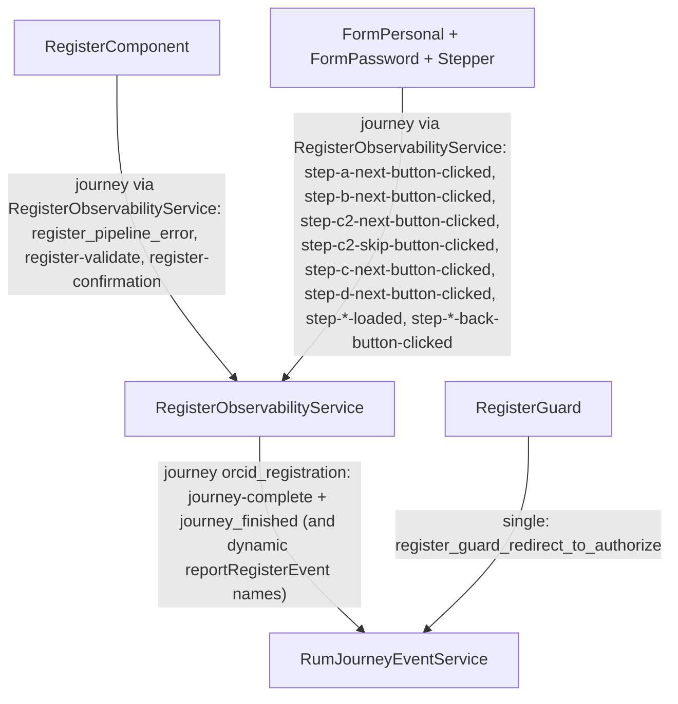

# Registration observability

## Purpose

Describe registration instrumentation end-to-end: journey lifecycle, step/funnel signals, and completion outcomes.

## Scope / Emitters

Primary emitters:

- `register/register-observability.service.ts`
- `register/pages/register/register.component.ts`
- `register/components/form-personal/form-personal.component.ts`
- `register/components/form-password/form-password.component.ts`
- `register/app-event-names.ts`

Related pre-flow guard signal:

- `guards/register.guard.ts` (`register_guard_redirect_to_authorize`)

## Event model

- Registration uses journey events with `journeyType = orcid_registration`.
- New Relic model:
  - `actionName = 'orcid_registration'`
  - logical event in `system_eventName`
  - journey context in `journeyContext_*`
  - per-event attrs in `eventAttribute_*`.

## Flow diagram

## Key events and where they fire

Journey events include:

- step loaded/clicked progression events (step A/B/C2/C/D)
- validate/confirmation stages
- `journey-complete` and `journey_finished` when completion path runs.

Simple event outside journey:

- `register_guard_redirect_to_authorize` from `RegisterGuard` for OAuth handoff pre-exits.

## NRQL query patterns

Journey funnel:

- `FROM PageAction SELECT count(*) WHERE actionName = 'orcid_registration' FACET system_eventName`

Completion view:

- `FROM PageAction SELECT count(*) WHERE actionName = 'orcid_registration' AND system_eventName IN ('journey-complete','journey_finished')`

Guard exits:

- `FROM PageAction SELECT count(*) WHERE actionName = 'register_guard_redirect_to_authorize'`

## Troubleshooting / gotchas

- Registration is mostly journey-based; querying by simple `actionName = 'register_*'` misses main funnel steps.
- Missing completion metrics often indicate redirect/response edge cases before `completeJourney(...)`.
- Reactivation and layout context are carried in journey context fields and should be used for segmentation.

