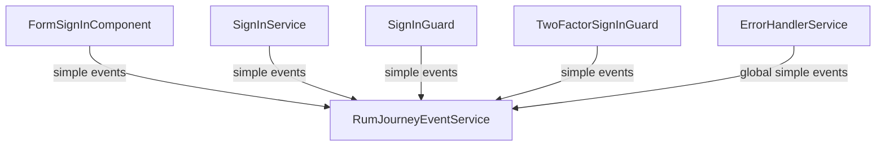

# Sign-in observability

## Purpose

Document sign-in observability signals, including component outcomes, service transport errors, and guard decisions.

## Scope / Emitters

Primary emitters (paths relative to `src/app/`):

- `sign-in/components/form-sign-in/form-sign-in.component.ts`
- `core/sign-in/sign-in.service.ts`
- `guards/sign-in.guard.ts`
- `guards/two-factor-signin.guard.ts`
- `core/error-handler/error-handler.service.ts` (global cross-cutting)

## Event model

- Sign-in uses simple events (no dedicated sign-in journey type).
- New Relic model:
  - `eventType() = 'PageAction'`
  - `actionName = <eventName>`.

## New Relic harvest on terminal outcomes

Sign-in success, failure, HTTP transport errors, guard redirects, and related simple events are classified as **terminating** where applicable; after `addPageAction` succeeds, `RumJourneyEventService` calls `forceHarvestNow()` so events are pushed before possible navigation away. See [`terminating-rum-events.ts`](./terminating-rum-events.ts) and the overview in [RUM README — Terminating events and New Relic harvest](./README.md#terminating-events-and-new-relic-harvest-flush).

## Flow diagram

## Key events and where they fire

Common sign-in event names:

- `sign_in_success`
- `sign_in_failure`
- `sign_in_http_error`
- `sign_in_oauth_invalid_grant_legacy`
- `sign_in_guard_redirect_to_authorize`
- `sign_in_guard_redirect_to_register`
- `two_factor_signin_guard_redirect_to_my_orcid`

`sign_in_failure` includes classification attrs (deprecated, disabled, unclaimed, bad verification/recovery code, invalid user type, bad credentials fallback).

## NRQL query patterns

Success vs failure:

- `FROM PageAction SELECT count(*) WHERE actionName IN ('sign_in_success','sign_in_failure') FACET actionName`

Transport errors:

- `FROM PageAction SELECT count(*) WHERE actionName = 'sign_in_http_error' FACET sign_in_flow, status`

Guard routing (includes `SignInGuard` and `TwoFactorSignInGuard`):

- `FROM PageAction SELECT count(*) WHERE actionName LIKE 'sign_in_guard_%' OR actionName = 'two_factor_signin_guard_redirect_to_my_orcid'`

## Troubleshooting / gotchas

- A single failing request can legitimately emit both `sign_in_http_error` and global `http_error`/`client_error`.
- `sign_in_oauth_invalid_grant_legacy` is legacy OAuth handoff specific, not a generic sign-in failure.
- Guard events can explain exits where users never submit the sign-in form.
